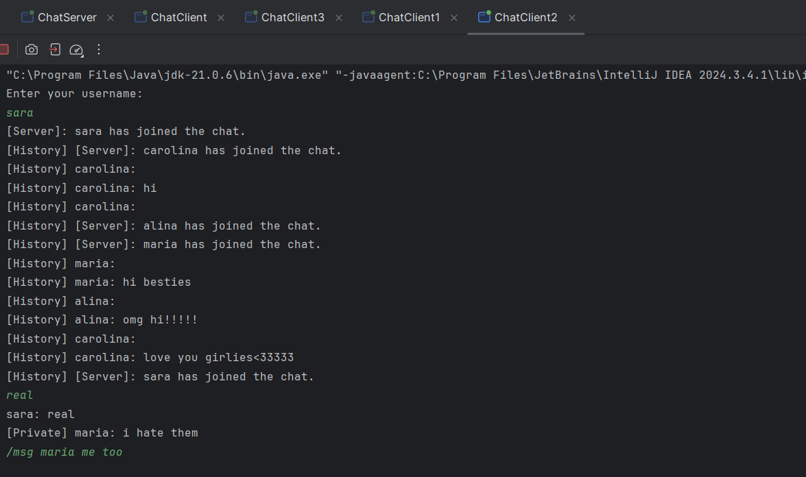

# OOP 2 - 2025 💻✨

This is the repository I used for the **Advanced Object-Oriented Programming** labs in my 3rd year at FMI, UB.

Each lab/project has its dedicated folder. 📂

## Summary 🧾

### Project [OOP 2](proiect/src/main/java/oop2_project).

### Lab 2 [exercises](proiect/src/main/java/Lab2).
### Lab 3 [exercise 1](proiect/src/main/java/lab3_ex1). 
### Lab 3 [exercise 2](proiect/src/main/java/lab3_ex2).
### Lab 3 [exercise 3 + bonus](proiect/src/main/java/lab3_ex3_bonus).
### Lab 4 [exercises](proiect/src/main/java/lab4_ex1).
### Lab 9 [practice](proiect/src/main/java/lab9).
### Lab 9 [exercise](proiect/src/main/java/lab9_ex1).
### Lab 10 [homework](proiect/src/main/java/lab10).
### Lab 11 [exercises](proiect/src/main/java/lab11).
### Lab 12 [classwork](proiect/src/main/java/lab12) && [classwork2](proiect/src/main/java/racecondition_ex1).
### Lab 12 [exercises](proiect/src/main/java/lab12_ex1).
### Lab 12 [homework](proiect/src/main/java/lab12_ex2).
### Lab 12 [homework](proiect/src/main/java/lab12_ex2).
### Lab 13 [homework](proiect/src/main/java/lab13_ex1).

